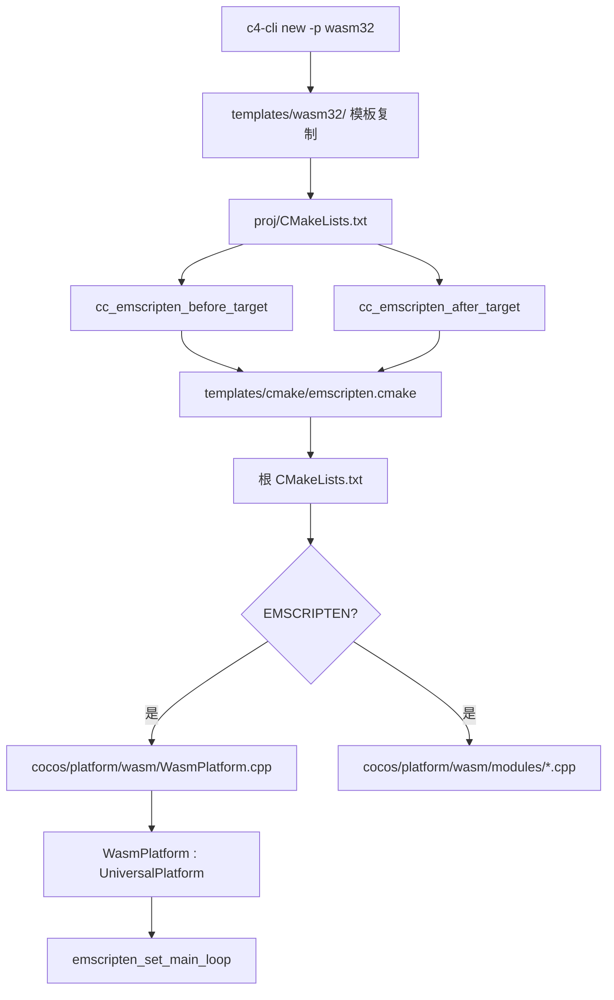

# 技术设计文档：wasm-platform-support

## 概述

本设计为 c4 引擎添加 WebAssembly（Wasm）平台编译支持。目标是让开发者通过 `c4-cli new -p wasm32` 创建项目，并通过 `emcmake cmake` + `cmake --build` 编译出可在浏览器中运行的 `.wasm` / `.js` 产物。

实现分为四个层次：
1. **平台实现层**：`cocos/platform/wasm/` — WasmPlatform 类及其模块
2. **引擎构建层**：根 `CMakeLists.txt` 添加 `EMSCRIPTEN` 条件分支
3. **CMake 宏层**：`templates/cmake/emscripten.cmake` 提供项目级构建宏
4. **工具层**：`templates/wasm32/` 模板 + `c4-cli` 命令支持

---

## 架构



### 编译流程

```
emcmake cmake .. -G Ninja
    └─ 检测 EMSCRIPTEN=1
    └─ 加载 elseif(EMSCRIPTEN) 分支
    └─ 编译 WasmPlatform + modules
    └─ 链接 -sUSE_WEBGL2=1 -sFULL_ES3=1 ...
cmake --build .
    └─ 产出 <ProjectName>.js + <ProjectName>.wasm
```

---

## 组件与接口

### 1. WasmPlatform（cocos/platform/wasm/）

继承 `UniversalPlatform`，是 Emscripten 环境下的平台入口。

**关键接口：**

| 方法 | 说明 |
|------|------|
| `init()` | 注册所有平台接口模块，返回 0 表示成功 |
| `loop()` | 调用 `emscripten_set_main_loop` 注册帧回调，立即返回 |
| `exit()` | 调用 `emscripten_cancel_main_loop()` + `onDestroy()` |

**与 EmptyPlatform 的差异：**
- `loop()` 不阻塞线程，改用 Emscripten 主循环机制
- `exit()` 需要取消 Emscripten 主循环

### 2. Wasm 平台模块（cocos/platform/wasm/modules/）

所有模块均为 stub 实现，直接复用 empty 平台的接口签名，行为与 empty 平台一致：

| 模块 | 接口 | 说明 |
|------|------|------|
| Accelerometer | IAccelerometer | 返回空数据 |
| Battery | IBattery | 返回默认值 |
| Network | INetwork | 返回 NetworkType::NONE |
| Screen | IScreen | 返回默认分辨率 |
| System | ISystem | 返回平台信息 |
| SystemWindow | ISystemWindow | 返回空窗口句柄 |
| SystemWindowManager | ISystemWindowManager | 管理窗口列表 |
| Vibrator | IVibrator | 空实现 |
| CanvasRenderingContext2DDelegate | ICanvasRenderingContext2D::Delegate | 软件渲染 stub |

### 3. emscripten.cmake 宏

提供两个宏，风格与 `linux.cmake` 保持一致：

**`cc_emscripten_before_target(_target_name)`**
- 设置 `CC_EXECUTABLE_NAME`（来自 `APP_NAME`）
- 将 `main.cpp` 加入 `CC_PROJ_SOURCES`
- 将所有源文件合并到 `CC_ALL_SOURCES`
- 调用 `cc_common_before_target`

**`cc_emscripten_after_target(_target_name)`**
- 链接 `${ENGINE_NAME}`
- 添加 `${CC_PROJECT_DIR}/../common/Classes` 到 include 路径
- 设置 Emscripten 链接选项（见需求 3.3）
- 设置输出后缀 `.js`（同时生成 `.wasm`）
- 条件性添加 `--preload-file`（当 `${RES_DIR}/data` 存在时）
- 调用 `cc_common_after_target`

### 4. templates/wasm32/ 模板

| 文件 | 说明 |
|------|------|
| `CMakeLists.txt` | 调用 emscripten 宏，风格同 linux 模板 |
| `main.cpp` | 与 linux 模板相同，调用 `START_PLATFORM` |
| `cfg.cmake` | 设置 wasm32 专属 CMake 选项 |

### 5. c4-cli 扩展

`new.js` 已有 wasm32 基础逻辑（模板复制、变量替换），需补充：
- 模板目录不存在时的错误处理
- 项目创建成功后输出 wasm32 专属构建提示

`run.js` 已有 wasm32 基础逻辑，无需修改。

---

## 数据模型

### CMake 变量约定

| 变量 | 值 | 说明 |
|------|----|------|
| `EMSCRIPTEN` | `1`（由 emcmake 自动设置） | 平台检测标志 |
| `CC_USE_GLES3` | `ON` | WebGL2 对应 GLES3 |
| `CC_USE_VULKAN` | `OFF` | Wasm 不支持 Vulkan |
| `CC_USE_METAL` | `OFF` | Wasm 不支持 Metal |
| `USE_SE_V8` | `OFF`（由 cfg.cmake 设置） | Wasm 使用内置 JS 引擎 |
| `CC_EXECUTABLE_NAME` | 项目名 | 最终产物文件名前缀 |
| `ENGINE_NAME` | `cocos_engine` | 引擎静态库目标名 |

### 项目目录结构（new 命令生成）

```
<ProjectName>/
├── CMakeLists.txt          # 根构建文件（自动生成）
├── .cocos-engine           # 引擎路径配置
├── proj/                   # 来自 templates/wasm32/
│   ├── CMakeLists.txt
│   ├── main.cpp
│   └── cfg.cmake
├── cmake/                  # 来自 templates/cmake/
│   ├── common.cmake
│   ├── emscripten.cmake
│   └── ...
├── common/                 # 来自 templates/common/
├── Classes/
└── Resources/
```

### 构建产物

```
build/
└── proj/
    ├── <ProjectName>.js    # Emscripten 胶水代码
    └── <ProjectName>.wasm  # WebAssembly 二进制
```

---

## 正确性属性

*属性（Property）是在系统所有有效执行中都应成立的特征或行为——本质上是对系统应做什么的形式化陈述。属性是人类可读规范与机器可验证正确性保证之间的桥梁。*

### 属性 1：init() 注册所有平台接口

*对于任意* WasmPlatform 实例，调用 `init()` 后，通过 `getInterface<T>()` 查询每个已注册接口类型（Accelerometer、Battery、Network、Screen、System、SystemWindowManager、Vibrator）均应返回非空指针。

**验证：需求 1.2**

### 属性 2：new 命令生成完整项目结构

*对于任意* 有效项目名称（符合 `[_0-9a-zA-Z-]+` 规则），执行 `c4-cli new -p wasm32 <ProjectName>` 后，生成的项目目录应包含 `proj/`、`cmake/`、`common/`、`Classes/`、`Resources/` 目录，以及 `CMakeLists.txt` 和 `.cocos-engine` 文件。

**验证：需求 4.4、5.1、5.2、5.3**

### 属性 3：模板变量替换完整性

*对于任意* 有效项目名称，执行 `c4-cli new -p wasm32 <ProjectName>` 后，`proj/` 目录下所有文本文件中不应再出现字符串 `CocosGame`，且应包含实际项目名称。

**验证：需求 4.5**

### 属性 4：Emscripten 编译选项正确配置

*对于任意* 使用 `cc_emscripten_after_target` 宏的 CMake 目标，该目标的链接选项应包含 `-sUSE_WEBGL2=1`、`-sFULL_ES3=1`、`-sALLOW_MEMORY_GROWTH=1`、`--bind`，且目标的 `SUFFIX` 属性应为 `.js`，include 路径应包含 `common/Classes`。

**验证：需求 3.3、3.4、3.6**

### 属性 5：wasm32 构建提示完整性

*对于任意* 成功创建的 wasm32 项目，`c4-cli new` 命令的输出应包含 emsdk 激活命令、`emcmake cmake` 配置命令、`cmake --build` 编译命令，以及 `python -m http.server` 预览命令。

**验证：需求 5.6**

### 属性 6：run 命令产物检测与预览提示

*对于任意* wasm32 项目，`c4-cli run -p wasm32` 命令应检测构建目录中 `.js` 或 `.wasm` 文件是否存在，并在输出中包含 `python -m http.server` 或等效的本地 HTTP 服务器预览命令。

**验证：需求 6.2、6.4**

---

## 错误处理

| 场景 | 处理方式 |
|------|----------|
| `templates/wasm32/` 目录不存在 | `c4-cli new` 输出明确错误信息，以非零状态码退出 |
| `WasmPlatform::init()` 模块注册失败 | 返回非零错误码，由 `BasePlatform::run()` 处理 |
| `emcmake cmake` 未找到 Emscripten | CMake 报告 `FATAL_ERROR`，提示用户激活 emsdk |
| 构建产物不存在时执行 `run` | 输出警告信息，提示检查构建目录路径 |
| 项目目录已存在时执行 `new` | 已有处理逻辑，输出错误并退出（现有行为） |

---

## 测试策略

### 双轨测试方法

本功能采用单元测试与属性测试相结合的方式：

- **单元测试**：验证具体示例、边界条件和错误处理
- **属性测试**：验证对所有输入都成立的普遍规律

### 单元测试（具体示例）

**平台层（C++，使用 GoogleTest）：**
- `WasmPlatform::init()` 返回 0
- `init()` 后各接口模块不为 null（对应属性 1 的具体示例）
- `exit()` 调用后 `_quit` 标志为 true

**CMake 配置（集成测试）：**
- `emcmake cmake` 配置成功（CMakeCache.txt 中 `CC_USE_GLES3=ON`）
- 构建产物包含 `.js` 和 `.wasm` 文件

**c4-cli（Node.js，使用 Jest）：**
- `new -p wasm32 MyGame` 创建 `proj/CMakeLists.txt`（对应属性 2 的具体示例）
- `new -p wasm32 MyGame` 后 `proj/main.cpp` 不含 `CocosGame`（对应属性 3 的具体示例）
- `templates/wasm32/` 不存在时 `new` 以非零状态码退出（边界条件）
- `run -p wasm32` 输出包含 `http.server`（对应属性 6 的具体示例）

### 属性测试（使用 fast-check，Node.js 部分）

每个属性测试最少运行 100 次迭代。

**属性 2 的属性测试：**
```javascript
// Feature: wasm-platform-support, Property 2: new 命令生成完整项目结构
fc.assert(fc.asyncProperty(
  fc.stringMatching(/^[_0-9a-zA-Z-]+$/),
  async (projectName) => {
    await newCommand(projectName, { platform: 'wasm32' });
    const dirs = ['proj', 'cmake', 'common', 'Classes', 'Resources'];
    for (const dir of dirs) {
      expect(await fs.pathExists(path.join(projectName, dir))).toBe(true);
    }
  }
), { numRuns: 100 });
```

**属性 3 的属性测试：**
```javascript
// Feature: wasm-platform-support, Property 3: 模板变量替换完整性
fc.assert(fc.asyncProperty(
  fc.stringMatching(/^[_0-9a-zA-Z-]+$/),
  async (projectName) => {
    await newCommand(projectName, { platform: 'wasm32' });
    const content = await fs.readFile(path.join(projectName, 'proj/CMakeLists.txt'), 'utf8');
    expect(content).not.toContain('CocosGame');
    expect(content).toContain(projectName);
  }
), { numRuns: 100 });
```

**属性 5 的属性测试：**
```javascript
// Feature: wasm-platform-support, Property 5: wasm32 构建提示完整性
fc.assert(fc.asyncProperty(
  fc.stringMatching(/^[_0-9a-zA-Z-]+$/),
  async (projectName) => {
    const output = captureOutput(() => newCommand(projectName, { platform: 'wasm32' }));
    expect(output).toContain('emcmake');
    expect(output).toContain('cmake --build');
    expect(output).toContain('http.server');
  }
), { numRuns: 100 });
```

**属性 6 的属性测试：**
```javascript
// Feature: wasm-platform-support, Property 6: run 命令产物检测与预览提示
fc.assert(fc.asyncProperty(
  fc.boolean(), // 产物是否存在
  async (artifactExists) => {
    // 模拟构建目录
    const output = captureOutput(() => runCommand(projectPath, { platform: 'wasm32', skipRun: true }));
    expect(output).toContain('http.server');
  }
), { numRuns: 100 });
```

**C++ 属性测试（使用 RapidCheck）：**
```cpp
// Feature: wasm-platform-support, Property 1: init() 注册所有平台接口
rc::check("WasmPlatform init registers all interfaces", []() {
    WasmPlatform platform;
    RC_ASSERT(platform.init() == 0);
    RC_ASSERT(platform.getInterface<IAccelerometer>() != nullptr);
    RC_ASSERT(platform.getInterface<IBattery>() != nullptr);
    RC_ASSERT(platform.getInterface<INetwork>() != nullptr);
    RC_ASSERT(platform.getInterface<IScreen>() != nullptr);
    RC_ASSERT(platform.getInterface<ISystem>() != nullptr);
    RC_ASSERT(platform.getInterface<ISystemWindowManager>() != nullptr);
    RC_ASSERT(platform.getInterface<IVibrator>() != nullptr);
});
```
